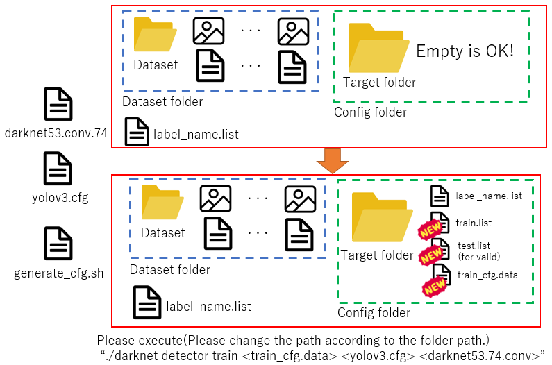

# Generate configure for YOLO

## Description

- Automatic Generate configure files to train YOLO.
-  All you have to do is prepare the files for the dataset and labels, and the files needed for training will be generated.
-  You may need to prepare the yolov3.cfg file and customize it yourself. The weight uses darknet53.conv.74.

## Requirement

- Ubuntu18.04LTS
- darknet YOLO v3(v4) https://github.com/pjreddie/darknet/tree/yolov3

## Installation

- `git clone https://github.com/Ar-Ray-code/generate_cfg_for_yolo`

## Usage

`sh generate_config.sh <target_folder_path> <target_data_folder_path> <name_label file_path>`

- <target_folder_path> : Select configure file path. (Generate and save to this path.)
- <target_data_folder_path> : Select your dataset folder path. (Include text and image file.)
- <name_label_file_path> : Select your label text file for dataset. (e.g. car , person , ..)

- Automatic download https://github.com/demulab/divide_files.git and rename .divide_files

## License

MIT : https://github.com/Ar-Ray-code/generate_cfg_for_yolo/blob/main/LICENSE

