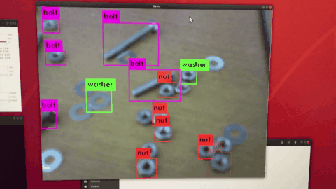

# YOLOv3-tinyでお手軽物体検出

作成者：DaichiArai

作成日：2021/01/19

本資料で使用したデータ：https://github.com/DaichiArai/yolov3_tiny_tutorial

## 全体の流れ

0. 環境構築

1. 画像の撮影
2. アノテーション
3. 水増し
4. 設定ファイルの作成（1）：cfgファイルの作成
5. 設定ファイルの作成(2)：パスを通す
6. 学習
7. 検証

## 0．環境構築

　本資料では，次の環境で実行しています．

#### [ハードウェア]

- CPU：Ryzen7 2700x @3.7GHz 16 threads
- GPU：RTX2080Ti 11GB VRAM
- RAM：16GB DDR4
- Power：SUPER FLOWER LEADEXⅢGOLD 850W

#### [ソフトウェア]

- OS：Ubuntu18.04.4 LTS Desktop
- Nvidia-Driver：version 460

- ROS：Melodic
- CMake：ROSに依存→2.8
- CUDA：10.2(推奨：10.0)
- cudnn：CUDAに依存
- OpenCV：ROSに依存(3.2)


Ubuntuの環境構築について説明します。MInimal installationが終了していると仮定します。

##### 0.1：パッケージの更新

```bash
$ sudo apt update && sudo apt upgrade
```

##### 0.2：Nvidia Driverのインストール

- https://www.nvidia.co.jp/Download/index.aspx?lang=jpより、Nvidia GPUドライバをダウンロードします。GPUの指定を行い、検索して、Ubuntu用のグラフィックスドライバをダウンロードします。

```bash
$ sudo apt install cmake make
$ sudo vim /etc/modprobe.d/blacklist-nouveau.conf
## vimの編集画面
> blacklist nouveau
> options nouveau modeset=0
## esc→:wq→Enterで終了
$ sudo update-initramfs -u
$ sudo reboot
```

- 再度ログインします

```bash
$ cd Downloads
$ sudo bash NVIDIA-Linux-x86_64-???.??.run ### ???にはバージョンが入る
$ sudo reboot
```

- bash NVIDIA...runの項目について：普通は全ての項目に対してEnterで対応します。

```bash
$ nvidia-smi
>日付       
>+-----------------------------------------------------------------------------+
>| NVIDIA-SMI ???.??       Driver Version: ???.??       CUDA Version: ??.??     |
>|-------------------------------+----------------------+----------------------+
>| GPU  Name        Persistence-M| Bus-Id        Disp.A | Volatile Uncorr. ECC |>
>| Fan  Temp  Perf  Pwr:Usage/Cap|         Memory-Usage | GPU-Util  Compute M. |
>|===============================+======================+======================|
>|   0  GeForce RTX 2080Ti  Off  | 00000000:04:00.0  On |                  N/A |
>| ??%   ??C    P8    ??W / 260W |    ???MiB / 11000MiB |     ??%      Default |
>+-------------------------------+----------------------+----------------------+

>+-----------------------------------------------------------------------------+
>| Processes:                                                       GPU Memory |
>|  GPU       PID   Type   Process name                             Usage      |
>|=============================================================================|
>|    0      ????      G   /usr/lib/xorg/Xorg                            ??MiB |
>+-----------------------------------------------------------------------------+
```

- nvidia-smiのコマンドで次のような画面が出れば成功です。（???は数字が入ります）

##### 0.3：CUDA10.0のインストール

- CUDA toolkit 10.0をインストールします。5GB程度をインストールするため、十分なネットワーク環境とディスク容量を確保することをお勧めします。
- https://developer.nvidia.com/cuda-10.0-download-archiveより、Lunux→x86_64→Ubuntu→18.04→deb[network)]を選択。
- Base Installer(2.9KB)をインストール
```bash
$ sudo dpkg -i cuda-repo-ubuntu1804_10.0.130-1_amd64.deb`
$ sudo apt-key adv --fetch-keys https://developer.download.nvidia.com/compute/cuda/repos/ubuntu1804/x86_64/7fa2af80.pub
$ sudo apt-get update
$ sudo apt-get install cuda-10-0 cuda-toolkit-10-0
$ sudo reboot
```

cuDNNのインストールはこちらから（オプション）。https://developer.nvidia.com/CUDNN

　cuDNNはディープニューラルネットワーク専用のライブラリで、機械学習の学習・検出速度を飛躍的に向上させます。darknetも対応しています。

##### 0.4：ROS-Melodicのインストール

- ROS-Melodicをインストールしなくてもいいですが、ROS-MelodicをインストールするとROSを使用できるほか、OpenCV3.2を最も簡単にインストールできるため，お勧めのインストール方法です。

```bash
$ sudo sh -c 'echo "deb http://packages.ros.org/ros/ubuntu $(lsb_release -sc) main" > /etc/apt/sources.list.d/ros-latest.list'
$ sudo apt-key adv --keyserver 'hkp://keyserver.ubuntu.com:80' --recv-key C1CF6E31E6BADE8868B172B4F42ED6FBAB17C654
$ sudo apt update
$ sudo apt install ros-melodic-desktop && sudo apt install ros-melodic-vision-opencv
$ echo "source /opt/ros/melodic/setup.bash" >> ~/.bashrc
```

##### 0.5：darknetの導入

　Darknetは2種類あります。AlexeyABのほうが現在最新となっており使い勝手がよくお勧めです。この時点では、pjreddieの実装を使用しています。使用方法はほとんど同じです。pjreddieで通るコマンドはAlexeyABでも通ります。

- https://github.com/pjreddie/darknet
- https://github.com/AlexeyAB/darknet (Yolo v4に対応)

　ダウンロードとコンパイルを行います。

``` bash
$ sudo apt install git
$ git clone https://github.com/pjreddie/darknet.git
$ cd darknet
$ vim Makefile
## 次の項目を変更
> 1行目(CUDA10の導入が必要)
>  GPU=0をGPU=1に変更
> 2・3行目（高速化の場合、cudnnを導入すること）
>　CUDNN=0をCUDNN=1，CUDNN_HALF=0をCUDNN_HALF=1に変更
> 4行目(ビデオ入力を行う場合必須)
>　OPENCV=0をOPENCV=1に変更
> どこかにNVCCがある
>　NVCC=nvccをNVCC=/usr/local/cuda/bin/nvccに変更
## escape→:wqで保存して終了
$ make
```

　darknet（拡張子なし）というファイルが生成されれば、成功。

## 1．画像の撮影

 　質のよい大きな画像を多く撮影します。この工程によって検出精度が大きく変わります。今回は、ボルト・ナット・ワッシャー・スプリングワッシャーを検出するため、それが含まれる画像を撮影します。今回は、簡単のために6枚撮影してそれを分割します。画像収集の目安は、最低1000枚、理想は1万枚程度と言われています。


　また、今回は、学習の成果を検証するために全く学習とテストに用いない画像を用意します。これを「ignore.jpg」と名付けます。


　収集したデータを切り抜きます。1枚から10枚生成します。6枚あるので60枚です。


## 2．アノテーション

　様々なツールがあります。好きなものを選びましょう。私は、[Yolo_Label](https://github.com/developer0hye/Yolo_Label)を使用します。かなり面倒なので、頑張りましょう。

　画像を保存しているフォルダとラベリングの名称が記載されたファイルを用意します。ここで、ラベリングテキスト「label_name.txt」を示します。

[label_name.txt]

```bash
$ vim label_name.txt
## 新規作成したファイルに次を追記
> bolt
> nut
> washer
> spring_washer
## escape→:wqで終了
```

　Yolo_labelでのアノテーションの様子です。↓


## 3．水増し

　アノテーション工程が終われば、おそらくデータセットフォルダには画像とテキストファイルのネットが画像枚数分だけあります。紐づけされている画像とテキストファイルの名称は一致しているはずです。


　しかし、60枚の画像では話にならないので、画像の「水増し」を行います。水増しとは、画像に対してフィルタやノイズ、画像の反転などの処理を行って1枚の画像から様々な状況の画像を生成します。


　画像水増しプログラムはこの[リポジトリ](https://github.com/DaichiArai/yolo_augmentation)にあります。フォルダ名は「dataset_folder」とし、拡張子はjpgとします。

```bash
$ git clone https://github.com/DaichiArai/yolo_augmentation.git
$ sudo apt install python3-pip
$ pip3 install opencv-python
$ cd yolo_augmentation/
$ python3 yolo_augmentation.py -p ../dataset_folder -f jpg
```

　PyQtがインポートできるなら、`$ python3 yolo_augmentation_gui.py`でGUIアプリを使用することもできます。

　このプログラムでは24倍の水増しを行います。つまり、jpgファイルとtxtファイルが24倍になりました。60x24=1440枚になったはずです。

## 4．設定ファイルの作成(1)：cfgファイルの作成

　yolov3-tiny.cfgに代わるファイルを作成します。yolov3.cfgはdarknetディレクトリ下にあるcfg/にあります。yolov3-tiny.cfgをコピーして自分の設定用のフォルダ「config」内に貼り付けて編集します。

```bash
$ vim yolov3-tiny.cfg
### 編集か所
- batchの項目：batch=16に変更。ただし、理想は64。2の倍数にすること。
- subdivisionの項目：subdivision=2に変更。メモリ不足になるなら2の倍数でその数を増やすのも可。

- [yolo]のブロック内について（tinyの場合2か所、yolov3、4の場合3か所）
	- classesの項目：classes=4に変更。
- [yolo]のブロックの一つ前のブロックにある項目について（tinyの場合2か所、yolov3、4の場合3か所）
	- filtersの項目：filters=27に変更。（計算式は、filters=3x(classesの値+5)で求める。）
### escape→:wqで終了
```

　yolov3の初期重みである。darknet53.covn.74をダウンロードします。

直接のダウンロードリンク→（https://pjreddie.com/media/files/darknet53.conv.74）

## 5．設定ファイルの作成(2)：パスを通す

　学習を行うためには、学習用のデータパス集（text形式ファイル）とテスト用のデータパス集とそれらのファイルの場所を記述したファイルの4種類が必要となります。それらを手動で生成してもいいですが、自動で生成可能なスクリプトを作成しています。

[リポジトリはこちら(generae_cfg_for_YOLO)](https://github.com/DaichiArai/generate_cfg_for_YOLO)

　使用方法は、<>内のフォルダについて相対パスか絶対パスを指定することを前提にして、

```bash
$ sh generate_config.sh <設定ファイルを格納するフォルダ> <データセットフォルダ> <ラベル用テキスト>
```

と実行するだけです。その結果、データセットを学習データとテストデータに分類したリストとそれらのファイルの絶対パスを格納したファイルを対象のフォルダに格納することができます。設定ファイルを格納するフォルダがそもそもなくても動作します。


## 6．学習

　ここまできたら、ようやく学習が可能になります。darknetのディレクトリ上で次のコマンドを実行します。＜※＞は、5で指定した設定フォルダを指します。絶対パスか相対パスで指定してください。

```bash
$ ./darknet detector train <※>/train_cfg.data <カスタム済yolov3-tiny.cfgのパス> <darknet53.conv.74のパス>
```

　学習が開始します。ハイエンドGPUだと半日～1日、ノートPCハイエンドGPUやミドルエンドGPUだと3日、ローエンドGPUだとそれ以上かかります。辛抱強く待ちましょう。

　また、GPUメモリには十分に注意しましょう。VRAMが8GB以下のGPUがbatch=64や32で学習する場合は、クラッシュする場合があるため、subdivision=16などに増やしたり、batch=16などに減らすと解消します。（GTX1650 4GB VRAMでYOLOv3学習の場合はbatch=16に対してsubdivision=16で学習させました。）放熱もきちんと行いましょう。GPUや電源の寿命にかかわります。


　学習は1万回程度で大体収束し、2～3万回程度になると十分収束します。学習済重みは、<※>/backupに保存されます。(プロジェクト名)_30000.weightsが生成されれば、Ctrl+cで中止させましょう。ちなみに、backupファイルから学習を再開させることもできます。

　損失関数のグラフは次のようになります。深層学習の学習進捗は損失関数で示し、これが0に近づくほど精度が良くなっていることを示します。


## 7．検証

　早速生成された重みを学習に使っていきましょう。実行は以下の通りです。

```bash
$ ./darknet detector test <※>/train_cfg.data <カスタム済yolov3-tiny.cfgのパス> <※>/backup/<任意のweightsファイル>　<対象の画像>
```

　学習に用いなかった「ignore.jpg」をそれぞれの重みについて検証してみました。


　3000回学習後は、そもそもボルトを検出できていません。10000回学習後はすべての物体が検出されました。しかし、30000回後は短いボルトが検出されませんでした。

　3000回学習後の画像では、学習が十分に進んでいないということが分かります。また、30000回学習後は長いほうのボルトに最適化されて短いボルトに反応しなくなってしまったといえます。30000回学習後の状況は「過学習」といい、汎用性を失った(＝学習回数に対して十分なパターンのデータを学習していない)状態といえます。深層学習においては学習しすぎもよくないということが分かります。


　次に広範囲を写した元画像を認識させました。


誤検出や未検出が目立つ結果となりました。学習させたデータと検証データが同じなのにも関わらず、距離や位置関係によって誤検出・未検出が多発することもあります。

　Webカメラで取得した映像に適応させてみましょう。

```bash
$ ./darknet detector demo <※>/train_cfg.data <カスタム済yolov3-tiny.cfgのパス> <※>/backup/<任意のweightsファイル>
```



　これも、誤検出・未検出が多発しています。動的な環境の場合は、様々な背景や影・重なりなども考慮して多くのデータを収集しておくとよいでしょう。

　深層学習はニューラルネットワークが深くなるほどあいまいな認識になり汎用性が向上するので、精度の向上を目指すならyolov3-tinyよりもyolov3でトレーニングしたほうがいいと思います。

　ぜひ挑戦してみてください。

<br></br>

[参考]

- Nvidia driverのインストール（参考）：https://qiita.com/kawazu191128/items/8a46308be6949f5bda57
- CUDAのインストール（参考）：https://qiita.com/yukoba/items/4733e8602fa4acabcc35

- ROSのインストール（公式）：http://wiki.ros.org/melodic/Installation/Ubuntu
- darknet（AlexeyAB）：https://github.com/AlexeyAB/darknet